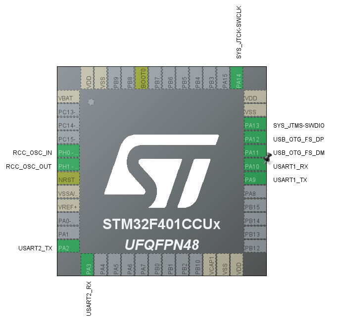
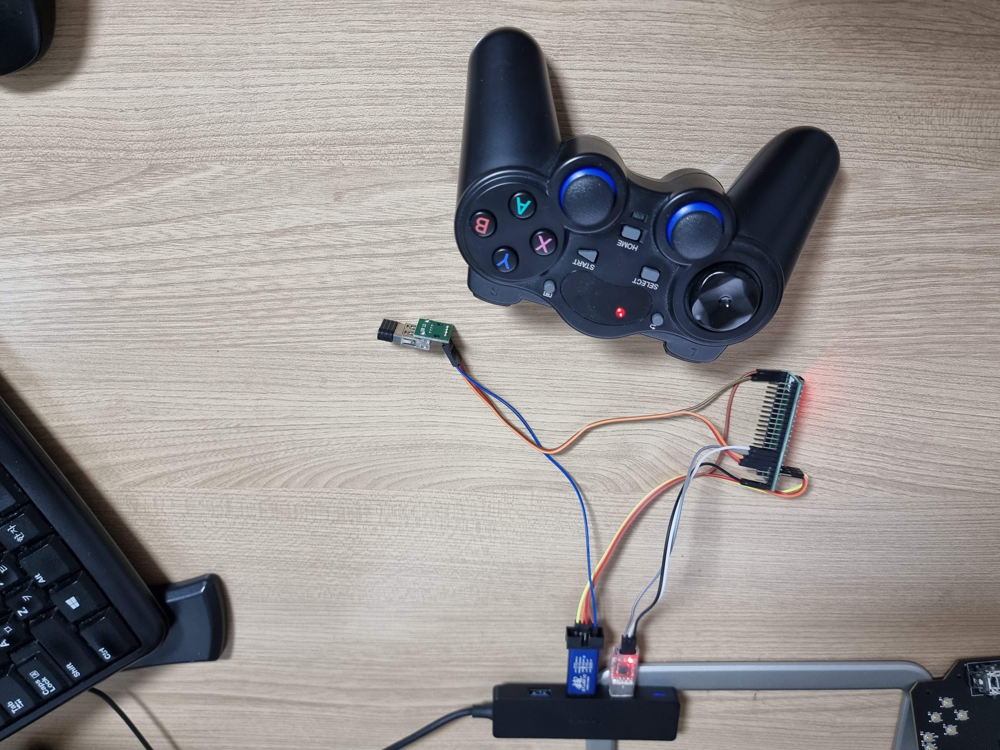
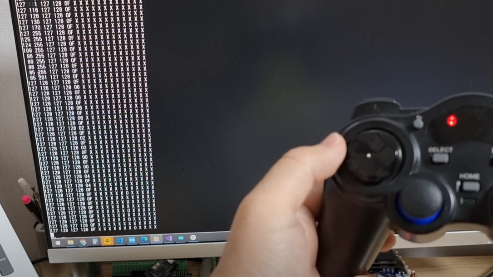
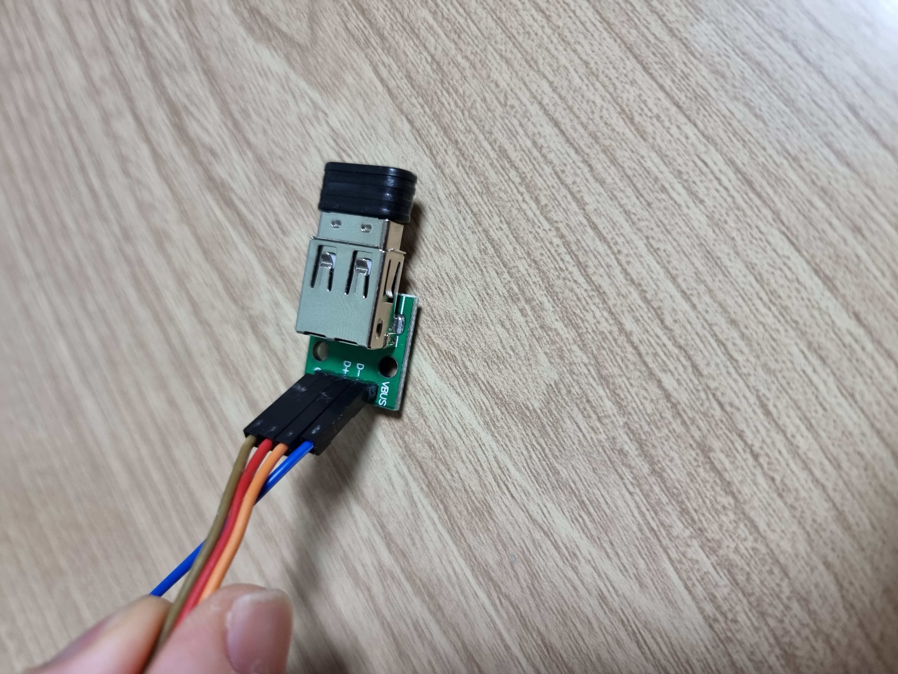
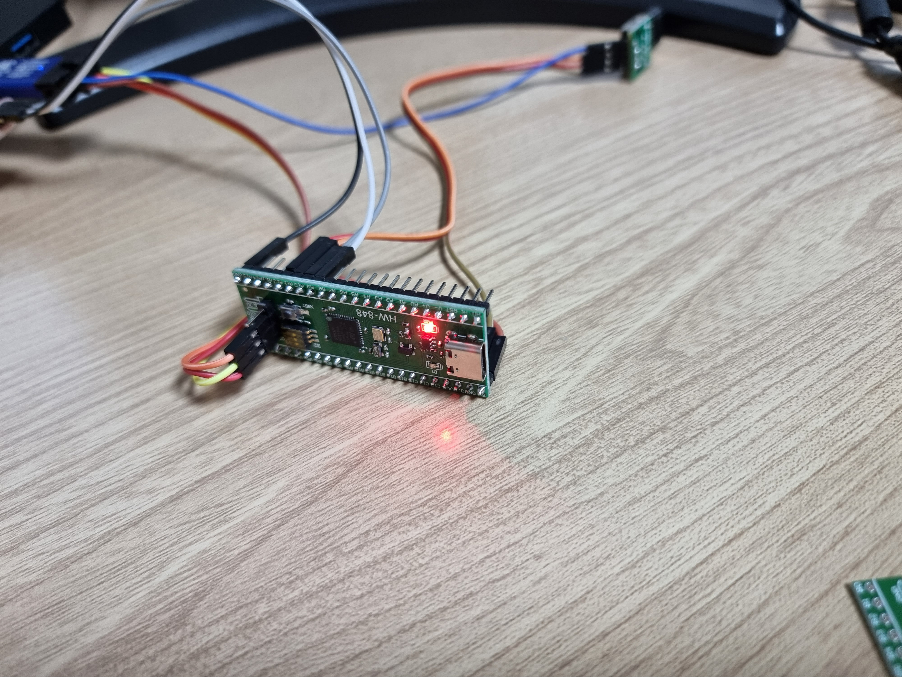
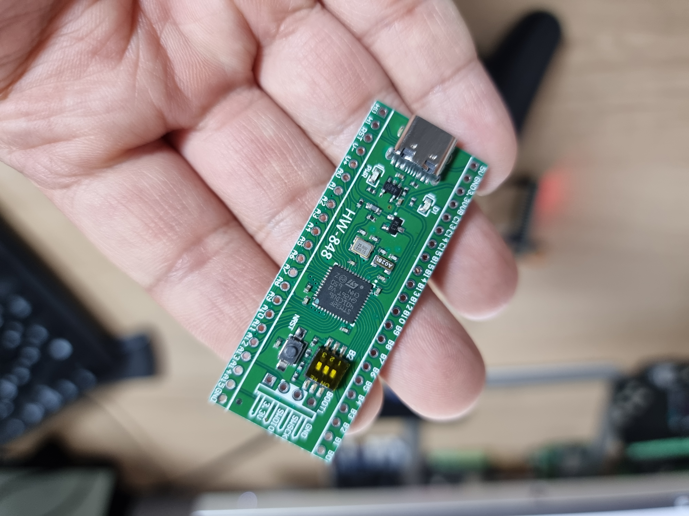
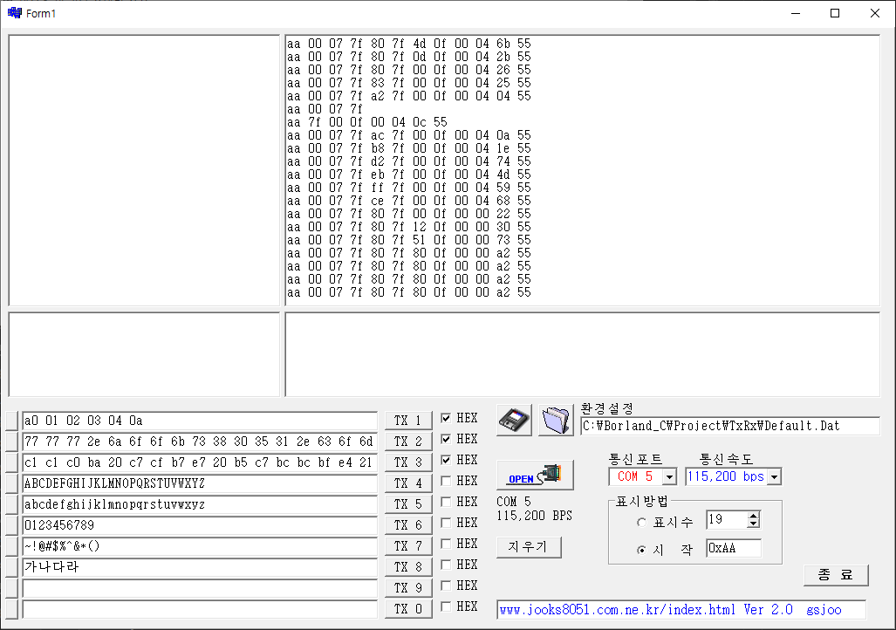

## STM32F401CCU USB HOST PS3 JOYSTICK

STM32F401CCU에서 USB Host 기능을 이용해 USB Hid Joystick를 제어하는 프로젝트입니다.

### 테스트 환경
    STM32CubeIDE : 1.7.0 (Build: 10852_20210715_0634(UTC))

### 핀 사양

UART1에는 일반 디버그 메시지를 출력하고

UART2에는 UART Packet으로 조이스틱 상태를 전송합니다.

    UART2 프로토콜 

    [STX] [ID] [LEN] [DATA..] [XOR CHECKSUM] [ETX]

    STX: 0xAA
    ETX: 0x55

UART2 DATA 구조
    
    typedef struct _HID_JOYSTICK_Info
    {
        uint8_t              left_axis_x;  // INDEX 1 Byte
        uint8_t              left_axis_y;  // INDEX 2 Byte
        uint8_t              right_axis_x; // INDEX 3 Byte
        uint8_t              right_axis_y; // INDEX 4 Byte

        uint8_t              pad_arrow:4;  // INDEX 5 Byte
        uint8_t              left_hat:1;
        uint8_t              right_hat:1;
        uint8_t              select:1;
        uint8_t              start:1;

        uint8_t              pad_a:1;      // INDEX 6 Byte
        uint8_t              pad_b:1;
        uint8_t              pad_x:1;
        uint8_t              pad_y:1;
        uint8_t              reserved:4;

        uint8_t              l1:1;         // INDEX 7 Byte
        uint8_t              l2:1; 
        uint8_t              r1:1;
        uint8_t              r2:1;
    } HID_JOYSTICK_Info_TypeDef;
    

[유튜브 데모 영상 보기](https://www.youtube.com/watch?v=UHCHiru6jNc&t=16s)

### 실제 연결된 모습

